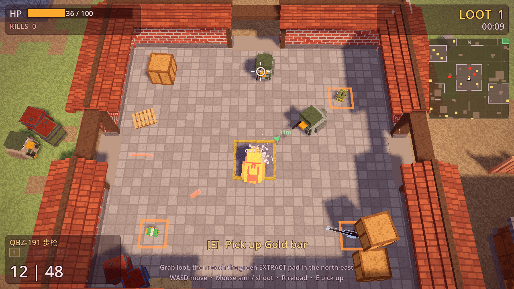
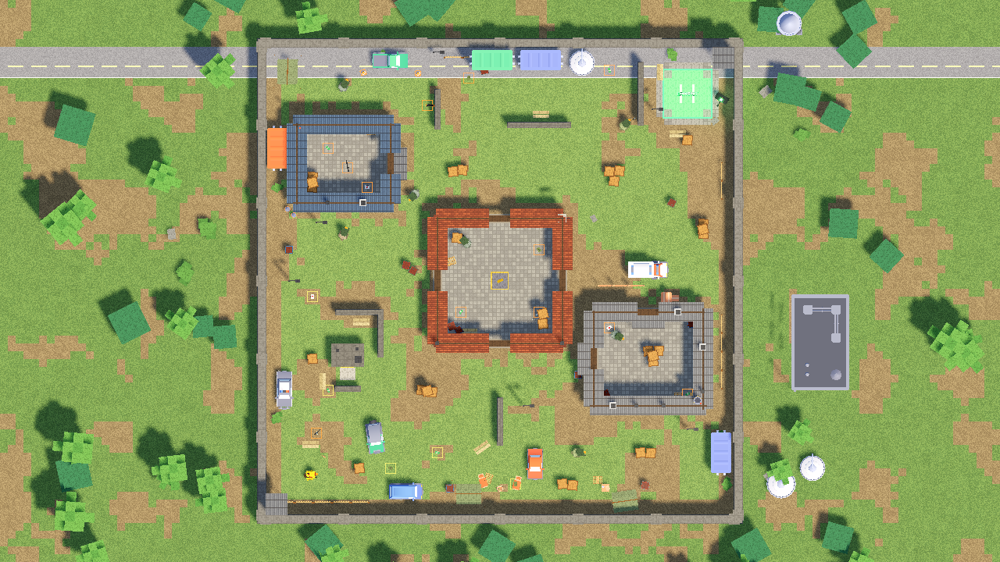
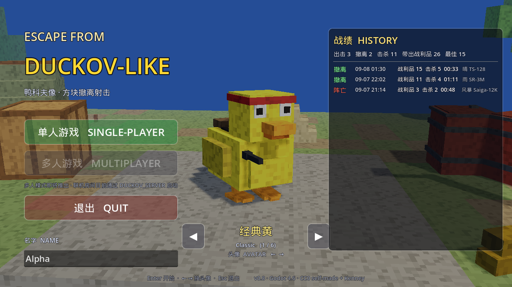
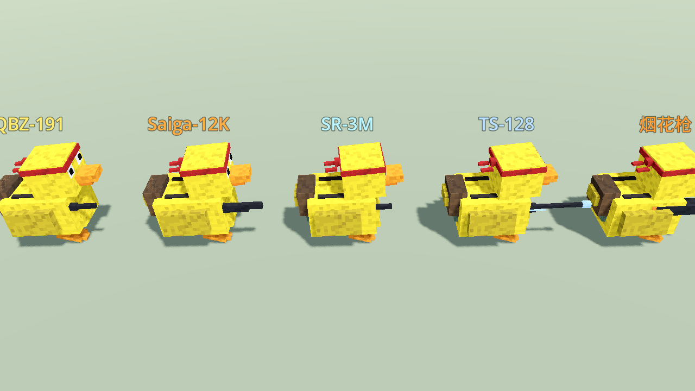

# Cube Duckov — an *Escape from Duckov*-like extraction shooter

A top-down 3D extraction shooter in Godot 4.6 (.NET / C#). You are a duck with a gun. Raid a
60×60 m arena, grab loot, and reach the green **EXTRACT** pad alive. One playable scene plus a
result overlay in the same scene. Single-player. The whole game was built by an AI coding agent from a series of
written briefs; this repository is the single-player part of that project (the online co-op client is not
published yet).





## Run

```bash
dotnet build                 # compile C#
godot --headless --import    # (first time / after asset changes)
godot --path .               # play: entry screen → single-player raid
```

The game opens on the **entry screen** (`scenes/Menu.tscn`): SINGLE-PLAYER starts a raid, MULTIPLAYER is greyed out for now, QUIT quits. Pick one of six duck avatars with ←/→,
type a name, and read your raid history on the right. Enter starts. On the result screen R restarts and Esc returns to the
menu. During a raid Esc pauses the game behind a confirmation dialog that returns to the entry screen (the music keeps
playing; nothing is recorded for an abandoned raid). Name, avatar and the last 50 raids persist in `user://profile.json` (override the path with `DUCKOV_PROFILE`).

Requires Godot 4.6.x .NET build and the .NET 9 SDK. 1280×720 window.

## Controls

| Key | Action |
|---|---|
| WASD / arrows | Move |
| Mouse | Aim (the duck faces the cursor) |
| Left mouse | Shoot (6 rounds/s cap, 12-round magazine, limited reserve) |
| R | Reload (in-raid) / Restart (on the result screen) |
| 1–5 / Q | Switch to weapon slot / next owned weapon (slots: 1 QBZ-191, 2 Saiga-12K, 3 SR-3M, 4 TS-128, 5 Firework Gun) |
| T | Cycle the weather (clear → rain → thunderstorm → snow → fog) |
| Esc | In-raid: pause and ask "Return to the start screen?" (Enter / Y yes, Esc / N no, or click). Result screen: back to the menu. Entry screen: quit |
| Enter / ← → | Entry screen: start · change avatar |
| E | Pick up highlighted loot |

## What is built

- **Player duck**: WASD movement, cursor aiming, hitscan-swept projectiles with fire-rate cap,
  per-weapon magazine + reserve ammo, reload (auto-reload on empty), 100 HP, hurt flash and
  camera kick, death animation.
- **Weapons** (Brief 6, names from the Escape from Duckov wiki): five guns with their own tracer, muzzle flash,
  hit effect and status effect — QBZ-191 rifle (default), Saiga-12K shotgun (6 pellets, 13 m), Frost SR-3M ice SMG
  (slows what it hits), TS-128 electric sniper (pierces two ducks, the charge arcs to a neighbour), Firework Gun
  firework launcher (arcing shell, 3 m burst). Guns lie on the map as loot and drop from the soldiers carrying
  them; the HUD shows the current gun, five slot squares and its ammo. See *Weapons pass* below.
- **7 enemy ducks** (helmeted soldiers; the compound guard carries a shotgun, the warehouse guard the ice SMG, the
  extraction guard the electric sniper, the rest rifles) patrol waypoint loops. Detection radius 14 m *with line of
  sight* (raycast against world geometry). They chase, hold ~7 m, shoot with distance-scaled spread,
  search the last known position when they lose you, return to patrol. Gunfire alerts enemies within
  13 m. 40 HP (two hits). 55 % chance to drop Ammo / Medkit / Cash on death.
- **Loot**: 14 items placed by hand — Cash (+1), Ammo box (+1, +24 reserve), Medkit (+1, +40 HP),
  Gold bar (+3). Safe pickups near spawn; the richer loot sits inside the central compound, the two
  buildings, and next to the extraction guard route. Highlighted with a floating name when in range.
- **Extraction**: glowing green pad in the north-east corner. Stand inside for 3 s (HUD countdown +
  bar, leaving decays the progress) → **EXTRACTED** with loot count, kills, time. Dying → **KIA**.
  R restarts the raid.
- **Map**: procedural 60×60 m arena — perimeter walls, a central brick compound with four doors,
  a west building, an east warehouse, L-shaped cover walls, crate clusters and barrels. A navigation
  mesh is baked at runtime over the static colliders and enemies path-find on it.
- **HUD**: HP bar, kills, ammo `mag | reserve`, reload prompt, loot counter, raid timer, extraction
  countdown, pickup prompt, crosshair at the aim point (with reload arc), direction arrow + distance
  to the extraction pad, hurt vignette, result overlay, and a **minimap** (top-right, north-up, 4 px/m, 50 m
  across): walls, paved zones and the road, loot squares (gold for the Gold bar), enemies within 16 m as red
  dots, teammates as blue dots with their initial, the extraction pad in green (edge marker when off-map), the
  player as a white arrow.
- **Entry screen, avatars, history** (Brief 8): `scripts/Menu.cs` builds the title screen over a live voxel diorama
  (stone stage, grass/dirt blocks, crates, barrels, sandbags, a tent, trees, a lit yard lamp) with the selected duck
  turning on the stage. Six avatars (`scripts/Avatar.cs`: Classic, Snow, Mallard, Bubblegum, Night Ops, Hi-Vis — body, backpack and
  bandana tints on the shared GLB) are applied to the player in the raid. `scripts/Profile.cs` persists name, avatar
  and a history of finished raids (date, EXTRACTED/KIA, loot, kills, time, weather, last weapon) plus totals; the panel
  shows the last ten. Autopilot / capture runs never write to the profile.
- **Weather** (Brief 7, after the Duckov maps): rain, the violet thunderstorm of the storm zone (lightning bolts, screen flash),
  the snow of lab area 37 (white ground, caps and roofs, drifting flakes) and dense fog. Sky, ambient, fog and sun blend
  between looks; rain wets and glosses every surface with puddle texels; yard lamps and the watchtower lights come on in
  bad weather; enemies see 15–45 % shorter. `DUCKOV_WEATHER=rain|storm|snow|fog|cycle`, `--weather=` on the capture
  scripts, or T in game; default clear, so the proof runs are unchanged.
- **Buildings** (Brief 7): two watchtowers on the perimeter corners (one over the extraction pad), a concrete bunker
  with blast wall and sandbags, six yard lamps, roll-up doors and door awnings on the warehouse, rooftop AC units,
  vents and antennas with red beacons, an exterior stair on the office block, brick corner pillars with a flag and
  loudspeakers on the compound, a plinth row under every wall, and signs (WAREHOUSE 3 / OFFICE).
- **Scene dressing** (Brief 5): a Duckov-style industrial yard on the same layout — asphalt service road along
  the north wall with shipping containers, a truck, cones and a storage tank; police / SUV / sedan / van wrecks;
  an ambulance at the warehouse door with crate stacks, a chain-link run and a chimney; a camp by the spawn
  (campfire, bedrolls, workbench, signpost); water tower, factory buildings and tanks as skyline outside the
  walls. Models are Kenney's CC0 kits (see *Assets*); everything is placed clear of the patrol routes and the
  autopilot waypoints, so enemies path the same and the scripted raid still extracts with 10 loot / 5 kills.
- **Camera**: top-down with a tilt, smooth follow with slight lead toward the aim point, shake.
- **Pause / quit to menu** (`scripts/PauseMenu.cs`): Esc in a raid pauses the tree and shows "PAUSED — Return to the
  start screen?" with YES (Enter / Y) and NO (Esc / N) buttons; the cursor is shown while open and hidden again on
  resume. The overlay and the music run with ProcessMode Always. Confirming swaps back to `Menu.tscn` exactly like the result screen does.
- **Sound** (weapon pass): every gun has its own synthesized fire sound — dry rifle crack, wide shotgun boom, light
  crystalline SMG snap, the sniper's rising charge zap + crack + electric buzz, the launcher's soft "thoomp" — plus the
  firework shell burst. Player and enemy shots both play (`Fx.MuzzleFlash` / `Fx.Explosion` → `scripts/Sfx.cs`), as
  positional `AudioStreamPlayer3D`s with ±4–8 % pitch jitter, heard from a ground-level listener on the camera rig so
  enemy fire falls off with map distance rather than from 21 m up. The WAVs are written by `tools/make_sfx.py` (numpy,
  CC0). No reload / hit / UI sounds yet.
- **Music**: *Scrapyard Pulse* (user-supplied, `assets/audio/Scrapyard Pulse.wav`, 52.6 s) loops as BGM from the entry
  screen through the raid and result without restarting (`scripts/Music.cs`, one player parked under the scene-tree root).
  It is mixed at −16 dB and dips a further 5 dB on every shot (recovering at 12 dB/s), so the guns always sit on top:
  in the recorded tour music-only seconds measure −26…−31 dB RMS, firefight seconds −6…−12 dB.
- **Visuals** (Brief 4 voxel pass, on top of Brief 2): Minecraft-style block look — every model is axis-aligned
  boxes, every surface is painted on a 16-texel-per-metre grid (nearest-filtered triplanar noise on GLB materials,
  texel-quantised shaders for ground / walls / roofs), the ground is 1 m grass / dirt / stone-brick blocks, roofs
  are stairs, the extraction pad is a pixel circle of glowing blocks, particles and tracers are cubes. See
  *Voxel pass (Brief 4)* below for what changed and how to roll back.
- **Visuals** (Brief 2 pass, still the basis): Blender-made low-poly duck GLBs (player with bandana + backpack, soldier with
  helmet + vest) with a procedural waddle (body roll, head bob, alternating webbed feet, wing flap) and a death
  fall; Blender-made props (crates, barrels in three colours, sandbag nests, fences, pallets, tents, rocks,
  bushes, round and pine trees, a radio beacon) and loot models (cash, medkit, ammo can, gold bars); brick /
  concrete / steel / rust wall shaders, pitched tile or corrugated roofs along the building walls (interiors stay
  open for the camera), door frames and windows; a zoned ground shader (grass, worn dirt, 2 m concrete slabs
  inside the compound, buildings and around the extraction pad); soft directional shadows, depth haze, colour
  grading, HUD vignette and panels; glowing tracers with soft halos, star muzzle flash with light, tumbling
  feathers and dust on hits, pulsing inverted-hull outlines on loot. Everything is CC0-free self-made:
  no downloaded or paid assets.

## What is left / ideas

- Online co-op: a Colyseus room client exists in the private branch of this project (shared loot, remote ducks,
  reconnect); it will be published once it has a lobby UI and server-side enemies.
- More sound: reload, hits, pickups, footsteps, weather ambience, UI.
- Enemy variety (shotgun / sniper ducks), enemy health bars.
- Doors, destructible cover, inventory weight, insured items — the full extraction-shooter loop.
- Bloom is off on purpose: Godot's glow pass halves the frame rate on llvmpipe (tracers fake it with additive
  halos). Turn `GlowEnabled` on in `scenes/BuildMain.cs` on a real GPU.

## Proof video

Videos and the full frame sequences are not committed; they are attached to the GitHub Releases or regenerated
with the commands below. Curated stills live in `docs/screenshots/`.

`screenshots/result/duckov_bgm_sfx.mp4` — 20 s with audio: entry screen → raid start → firefights; the Scrapyard Pulse
BGM runs underneath throughout and the gunshots stay clearly on top.

`screenshots/result/duckov_weapon_sfx.mp4` — 20 s of the scripted raid **with audio** (rifle bursts, then the Firework
Gun launch and burst); the movie writer captures the audio mix even under `--audio-driver Dummy`.

`screenshots/result/duckov_raid.mp4` — the full scripted raid (35 s, 1280×720, 30 fps): spawn, loot,
firefights, extraction countdown, EXTRACTED result, restart. Recorded with Godot's movie writer, so
every frame is rendered even on software Vulkan. Godot now writes an MJPEG AVI that ffmpeg transcodes to
H.264 — its PNG frame writer spent most of the time compressing the new, more detailed frames. llvmpipe
renders the raid at ~11 fps in movie-writer mode (same as before the visual pass; ~13 fps in the still
capture), so the 35 s clip records in about two minutes and plays back at 30 fps:

```bash
./record.sh raid     # or: ./record.sh kia;  ./record.sh menu  for the entry-screen tour
DUCKOV_WEATHER=cycle ./record.sh raid   # weather tour: rain → storm → snow → fog, 8 s each
```

## Proof captures

Still frames captured under `xvfb-run` with a scripted autopilot driving the player
(`test/Capture.cs` + `scripts/Autopilot.cs`), deterministic via `--fixed-fps 30`:

```bash
xvfb-run -a -s '-screen 0 1280x720x24' godot --path . --fixed-fps 30 \
  --script test/Capture.cs ++ --scenario=raid     # full loot run + extraction + restart
xvfb-run -a -s '-screen 0 1280x720x24' godot --path . --fixed-fps 30 \
  --script test/Capture.cs ++ --scenario=kia      # walk into the compound unarmed → KIA → restart
```

Both runs are deterministic (the scripted raid extracts at 00:33 every time with 15 loot / 5 kills;
the unarmed walk into the compound dies at about 00:12). Enemy RNG is now seeded from the route index instead of
the instance id, so the movie-writer recording and the still capture play out identically. Curated frames in `docs/screenshots/`;
the full timed sequence of both runs lands in `screenshots/result/sequence/` (pass `--dir=` to `Capture.cs`):

| Frame | Moment |
|---|---|
| `01_raid_start.png` | Spawn in the south-west corner: 1 m grass/dirt blocks, stone-brick perimeter wall, cube bushes and crates, HUD panels, minimap, extraction arrow |
| `02_first_pickup.png` | First Cash pickup: green pop ring, LOOT 1, sandbag nest and concrete cover ahead |
| `03_reload_under_fire.png` | The west-building guard drops to the Frost SR-3M: cyan tracers and frost cubes; iron-panel walls, L-shaped stone cover |
| `04_west_building_loot.png` | Inside the west building: blue corrugated stair roof, stone-brick floor, Cash highlighted with its square frame |
| `05_kill_then_pickup.png` | Kill by the north fence: feathers in the air, dead soldier lying, KILLS 3 |
| `06_compound_door_kill.png` | Firework Gun shell bursting inside the compound from the north doorway: fireball light on the stone bricks |
| `07_compound_gold_pedestal.png` | Inside the brick compound: 8×4-texel bricks, clay-tile stairs, the gold pedestal slab, a dead soldier, LOOT 8 |
| `08_extraction_countdown.png` | Standing on the H pad: EXTRACTING 1.4, blinking radio beacon, trees beyond the wall |
| `09_result_extracted.png` | Result overlay: EXTRACTED · Loot 15 · Kills 5 · Time 00:33 · Press R; TS-128 equipped, the dead sniper's drop by the pad |
| `10_kia_surrounded_at_gold.png` | Unarmed run: helmeted soldiers converge on the Gold bar, hurt vignette |
| `11_result_kia.png` | Result overlay: KIA · Lost 1 loot · Survived 00:12 |
| `12_restart_fresh_raid.png` | After R: new raid, timer 00:02, full HP, first pickup already done |

A human raid runs longer than the autopilot's 29 s (it aims perfectly and never hesitates); grabbing
half the loot and extracting takes a person roughly 60–90 s.

## Project layout

| Path | Purpose |
|---|---|
| `project.godot`, `Duckov.csproj` | Config (Jolt physics, 60 Hz ticks, input actions) |
| `scenes/BuildMain.cs` | Build-time generator: `godot --headless --script scenes/BuildMain.cs` → `scenes/Main.tscn` |
| `scenes/Main.tscn` | The raid scene: Game root, environment, sun, Arena, Player, CameraRig, HUD |
| `scripts/Game.cs` | Raid state, loot counter, timer, extraction countdown, result, restart |
| `scripts/Arena.cs` | Procedural map, loot spots, patrol routes, navmesh bake, extraction pad |
| `scripts/Player.cs`, `Enemy.cs`, `Bullet.cs`, `Loot.cs` | Gameplay actors |
| `scripts/Weapon.cs`, `Rocket.cs` | Weapon definitions, ammo state, box-built gun models; the firework shell |
| `scripts/DuckVisual.cs`, `Fx.cs` | GLB duck loader + procedural waddle/death animation; muzzle flash / feathers / sparks / pickup pop |
| `tools/make_duck.py`, `tools/make_props.py`, `tools/blib.py` | Blender headless model builders (`$BLENDER_BIN -b --python tools/make_props.py`) → `assets/models/` |
| `tools/snap.sh`, `tools/showcase.sh`, `test/Showcase.cs` | Quick preview stills of the running raid; close-up render of ducks/props/effects (`--fx`) |
| `test/Overview.cs`, `tools/glb_bounds.py` | Top-down whole-map still (`--out=`, `--size=`) or a perspective close-up (`--at=x,z --dist=`, `--weather=`); world-space AABB of GLB files |
| `scripts/Weather.cs` | Weather kinds, precipitation MultiMesh, lightning, sky/sun/fog blending, lamp control |
| `scenes/BuildMenu.cs` → `scenes/Menu.tscn`, `scripts/Menu.cs` | Entry screen (buttons, avatar picker, name, history, 3D diorama) |
| `scripts/Profile.cs`, `scripts/Avatar.cs`, `test/ProfileCheck.cs` | Persistent profile + raid history; avatar definitions; headless profile self-test |
| `assets/models/kenney/{industrial,cars,survival}/` | Kenney CC0 GLBs used by `Arena.BuildYard()` with their colormaps |
| `tools/glb_stats.py` | Triangle / material report for GLBs |
| `scripts/Hud.cs`, `CameraRig.cs` | UI and camera |
| `scripts/Autopilot.cs`, `test/Capture.cs` | Scripted player + still-frame capture for proof (`--scenario=raid|kia|menu|pause`; `pause` injects real Esc / Enter key events to exercise the in-raid pause dialog) |
| `tools/make_sfx.py` | numpy synthesizer for the weapon sound effects → `assets/audio/*.wav` |

## Decisions

- Scene is generated by a builder script (per `godot.md`); all map geometry, ducks and UI are
  created at runtime in C# because they are procedural anyway.
- Enemies use `NavigationServer3D.MapGetPath` on a runtime-baked navmesh instead of NavigationAgent3D
  — simpler and synchronous.
- Bullets are visible fast projectiles that sweep a ray each physics tick, so they never tunnel through
  walls and cover genuinely blocks shots.
- Fixed layout, fixed RNG seed: the raid is learnable, like a real extraction map.
- Camera sits 19 m up and 8.5 m back at 42° FOV (about 29 m of map across the screen); the first
  capture at 26 m made the duck unreadably small.
- Enemies alert on: seeing the player within 14 m with line of sight, being hit, or gunfire within 13 m.
  They keep chasing out to 24 m, then search the last known position for 4 s.
- Hurt feedback is deliberately mild (16 % red vignette, reddish duck flash) — the first pass washed
  the whole screen out.
- R doubles as reload (in raid) and restart (on the result overlay); both input actions bind the same key.
- Roofs are strips of pitched tiles along each wall, not full roofs, so the top-down camera still sees loot
  and enemies inside buildings.
- GLB props get a Box/Cylinder collider from their mesh AABB (never trimesh); decorative items (pallets,
  bushes, everything outside the walls) have no collider so the navmesh stays the same shape as before.
- Blender materials are authored in sRGB and converted to linear before export — glTF stores linear
  `baseColorFactor`, so unconverted colours render washed out.
- Ducks tint their `Body`/`Accent` materials per instance at load time (player yellow, three soldier
  camo shades), so one GLB per variant is enough.
- No glow/bloom, no SSAO/SSR/SDFGI/volumetrics: glow alone cost ~45 % of the frame rate on llvmpipe.
  Setting `ShadowBlur`/`ShadowOpacity` on the sun made shadows vanish on llvmpipe, so they stay default.
- The Godot `SynchronizationContext` resumes each `await` on the next frame, so a freed node must never stay
  referenced across a server round trip (`Player.NearbyLoot` is re-validated every tick).

## Assets

Ducks, props and loot are self-made in Blender 5.2 (headless scripts under `tools/`, CC0); the yard dressing uses
**Kenney** kits (CC0, https://kenney.nl — also published on itch.io as *Kenney Game Assets*); everything else is
procedural in Godot. Sound effects are synthesized (`tools/make_sfx.py`, CC0) into `assets/audio/`. The background music was generated
with Suno and is covered by its own notice (see *License*). No paid assets.
Sizes are the GLB files under `assets/models/`.

| Asset | Source | License | Size | Used for |
|---|---|---|---|---|
| `duck_player.glb` (408 tris, 9 parts) | `tools/make_duck.py` | CC0 (self-made) | 32 KB | Player duck: bandana, backpack, rifle |
| `duck_soldier.glb` (408 tris, 9 parts) | `tools/make_duck.py` | CC0 (self-made) | 31 KB | Enemy duck: helmet, vest with pouches, rifle |
| `props/crate.glb` (204 tris) | `tools/make_props.py` | CC0 (self-made) | 12 KB | Crates (single / stacked) |
| `props/barrel.glb` (72 tris) | `tools/make_props.py` | CC0 (self-made) | 6 KB | Barrels (square), tinted red / blue / olive at load |
| `props/sandbags.glb` (288 tris) | `tools/make_props.py` | CC0 (self-made) | 16 KB | Sandbag nests (cover) |
| `props/fence.glb` (156 tris) | `tools/make_props.py` | CC0 (self-made) | 10 KB | 2.4 m fence sections |
| `props/pallet.glb` (108 tris) | `tools/make_props.py` | CC0 (self-made) | 7 KB | Pallets (decorative) |
| `props/tent.glb` (132 tris) | `tools/make_props.py` | CC0 (self-made) | 9 KB | Camp tents (stair roof) |
| `props/beacon.glb` (180 tris) | `tools/make_props.py` | CC0 (self-made) | 12 KB | Extraction radio beacon with blinking lamp cube |
| `props/tree_round.glb` (264 tris), `props/tree_pine.glb` (72 tris) | `tools/make_props.py` | CC0 (self-made) | 16 KB / 5 KB | Oak (cube canopy) and pine (stacked tiers) outside the walls |
| `props/bush.glb` (48 tris), `props/rock.glb` (24 tris) | `tools/make_props.py` | CC0 (self-made) | 4 KB / 2 KB | Bushes and rocks |
| `props/loot_cash.glb`, `loot_medkit.glb`, `loot_ammo.glb`, `loot_gold.glb` (24–72 tris) | `tools/make_props.py` | CC0 (self-made) | 2–6 KB | Loot pickups |
| `kenney/industrial/` shipping-container-a/b/c, water-tower, detail-tank, detail-tank-large, chimney-medium, building-a | Kenney *City Kit (Industrial) 2.0* | CC0 | 0.9 MB incl. colormap | Containers (×7), tanks (×2.2–2.5), chimneys (×3–3.5), skyline (×4–6) |
| `kenney/cars/` truck, truck-flat, van, delivery, police, ambulance, sedan, suv, cone | Kenney *Car Kit 3.1* | CC0 | 0.8 MB incl. colormap | Vehicles (×1.6), traffic cones |
| `kenney/survival/` fence-fortified, fence, barrel-open, box-large, structure-metal, signpost, campfire-pit, bedroll, workbench, tree-tall | Kenney *Survival Kit 2.0* | CC0 | 0.5 MB incl. colormap | Chain-link run (×4), barrels and crate stacks (×3), camp props (×3–3.5) |
| Texel noise (16×16, 4 grey levels) | Runtime `Image`, `scripts/Blocky.cs` | — | — | Pixel look on every untextured GLB material (nearest, triplanar, 1 tile/m); Kenney colormaps keep their palette and get nearest filtering |
| Walls, stair roofs, door frames, windows, pedestal, extraction pad blocks | Procedural meshes + inline texel shaders, `scripts/Arena.cs` | — | — | Map |
| Ground | Inline texel shader (1 m zone blocks, 16 px/m) + runtime `FastNoiseLite` texture, `scripts/Arena.cs` | — | — | Grass / dirt / stone-brick zones, asphalt road with dashes |
| Tracers, muzzle flash, feathers, sparks, vignette | Inline shaders + cubes, `scripts/Bullet.cs`, `Fx.cs`, `Hud.cs` | — | — | Effects |
| Fonts | Godot default | — | — | HUD |
| `shot_rifle.wav` (0.28 s) | `tools/make_sfx.py` | CC0 (self-made) | 25 KB | QBZ-191 fire |
| `shot_shotgun.wav` (0.70 s) | `tools/make_sfx.py` | CC0 (self-made) | 62 KB | Saiga-12K fire |
| `shot_smg.wav` (0.09 s) | `tools/make_sfx.py` | CC0 (self-made) | 8 KB | Frost SR-3M fire |
| `shot_sniper.wav` (0.76 s) | `tools/make_sfx.py` | CC0 (self-made) | 67 KB | TS-128 fire |
| `shot_firework.wav` (0.60 s) | `tools/make_sfx.py` | CC0 (self-made) | 53 KB | Firework Gun launch |
| `explosion.wav` (1.40 s) | `tools/make_sfx.py` | CC0 (self-made) | 124 KB | Firework shell burst |
| `Scrapyard Pulse.wav` (52.6 s, 48 kHz stereo) | Suno (paid plan, official download) | **Not MIT** — see `assets/audio/NOTICE-music.md`; no remixing | 9.9 MB | Background music (looped, −16 dB, ducks under shots) |

Regenerate the models with `$BLENDER_BIN -b --python tools/make_duck.py` and `... tools/make_props.py`, then
`godot --headless --import`.

## Entry screen pass (Brief 8)



Built in four commits, one per task: **1** profile + history (`1d11f20`), **2** avatars (`df5dec8`), **3+4** the menu
scene and the flow (`scenes/BuildMenu.cs` → `Menu.tscn`, main scene switched to it, Esc on the result screen returns,
`Capture --scenario=menu`), **5** proof + README. Each is revertible on its own.

- **Persistence**: `user://profile.json` (`{ Name, Avatar, History[] }`, newest first, capped at 50) via System.Text.Json;
  written on every menu start and every raid end. `DUCKOV_PROFILE=<path>` redirects it (the capture scripts point it at a
  throwaway file under `screenshots/video/`). Self-test: `godot --headless --path . --script test/ProfileCheck.cs`.
- **Avatars**: the avatar only tints materials, so animation, weapons, colliders and the deterministic runs are
  untouched; capture scenarios force avatar 0 so the proof stills keep the classic yellow duck.
- **Multiplayer button**: greyed with a "Coming soon" tooltip on purpose — the co-op client is not part of this repository yet.
- **Proof**: `./record.sh menu` records the tour — the menu, four avatar changes, start, then the scripted raid played
  as the chosen duck (`screenshots/result/duckov_menu.mp4`); `docs/screenshots/menu.png` and `avatars.png`.

## Weather + buildings pass (Brief 7)

Reference: the map index at escapefromduckov.net/zh/maps (the detail pages are interactive with no prose, so the
map images were used: the storm zone's violet storm, lab area 37's snow base, the warehouse district's rows, the bunker). Two commits,
each revertible on its own.

**Weather** (`ec44c9e`, `scripts/Weather.cs`)

| Kind | Look | Effects | Enemy sight |
|---|---|---|---|
| Rain | grey-blue sky, cooler dim sun, haze 14–50 m | 420 falling streaks (one MultiMesh of thin boxes tilted along the wind), splashes, `wet` = darker + glossy surfaces with puddle texels | × 0.85 |
| Thunderstorm | violet sky (storm zone), sun 0.35, haze 10–40 m | 700 heavier streaks, every 3.5–8 s a bolt (jagged `Fx.Arc` from 30 m up, electric burst, sun/ambient spike, screen flash, camera kick), lamps on | × 0.7 |
| Snow | pale sky, soft sun | 320 drifting flakes, `snow` = white ground (road keeps its lanes), white wall caps and roofs | × 0.9 |
| Fog | flat grey, haze 12–40 m | no precipitation, lamps on | × 0.55 |

Looks blend over 1.6 s; the weather has its own RNG so `Game.Rng` and the deterministic runs are untouched. `cycle`
changes weather every 8 s (used for the proof video). Stills: `docs/screenshots/weather/{rain,storm,snow,fog}.png`.

**Buildings** (`f87369e`, `Arena.BuildDetails()`)

Watchtowers (`Watchtower`), the bunker (`Bunker`) and the six lamp posts (`Lamp`) have colliders and were placed off
the patrol routes and the autopilot waypoints; everything else is visual (roll-up doors, awnings, rooftop units, vents,
antennas, stair, pillars, flag, horns, plinths, signs). Navmesh 579 → 645 polygons; the scripted raid still ends
**EXTRACTED · Kills 5 · 00:33** (loot 14–15 depending on where the extraction guard's gun lands). Close-ups:
`docs/screenshots/buildings/{warehouse,bunker,tower,office}.png` (`test/Overview.cs --at=x,z --dist=`).

## Weapons pass (Brief 6)



One commit (`a573efa`, revertible on its own). Weapon data lives in `scripts/Weapon.cs` (`WeaponDef`, per-owner
`WeaponState`, and `WeaponMesh`, the box-built gun models shown on ducks and as ground loot); the firework shell is
`scripts/Rocket.cs`. Names and the elemental flavours (ice / electric / fire variants, novelty launchers) follow the
wiki's categories at escapefromduckov.net/zh/wiki/weapons; the numbers are ours.

| Slot | Weapon | Damage · rate · mag · reload | Tracer / flash | Effect |
|---|---|---|---|---|
| 1 | **QBZ-191 Rifle** | 20 · 6/s · 12 · 1.3 s | Yellow box tracer, yellow star flash | The Brief 1 rifle, unchanged |
| 2 | **Saiga-12K Shotgun** | 9 × 6 pellets · 1.1/s · 5 · 2.0 s | Short fat orange pellets that die at 13 m; big orange bloom, sparks and smoke, heavy kick | Spread 11° |
| 3 | **Frost SR-3M SMG** | 8 · 12/s · 30 · 1.6 s | Cyan needle tracers; small pale star with drifting frost cubes | **Ice**: frost burst on hit, target slowed to 45 % for 2.5 s (the player to 60 % for 1.5 s), frosty tint |
| 4 | **TS-128 Smart Sniper** | 55 · 0.9/s · 4 · 2.2 s | Long bright blue bolt (110 m/s); white-blue star with crackling arcs | **Electric**: pierces two ducks; the charge arcs (jagged lightning) to the nearest other duck within 3.5 m for 40 % damage |
| 5 | **Firework Gun** | 40 in 3 m (falls off) · 0.8/s · 3 · 2.4 s | Red shell with a smoke trail on a flat arc; red-orange bloom | **Fire**: fireball of cubes, embers, smoke, expanding ground ring, light, camera kick; the bang alerts enemies |

- **Getting guns**: four lie on the map (SR-3M by the camp, Saiga-12K in the west building, Firework Gun behind the north
  cover wall, TS-128 in the compound); soldiers drop the gun they carry. A new gun is equipped with two spare
  magazines, a duplicate adds one. An ammo box refills the *current* gun by its own amount (24 / 10 / 30 / 4 / 3).
  Weapon loot counts as loot (+1).
- **Enemy loadouts** (`Game._Ready`, by route): shotgun (6 × 4 dmg, 12 m), ice SMG (3 dmg at 5/s, slows you), electric
  sniper (16 dmg, 90 m/s, engages from 22 m); the rest keep the rifle. Their tracers and flashes match the gun.
- **Autopilot** picks the gun by range each tick (shotgun < 8 m, firework 9–15 m while it has shells, sniper ≥ 12 m,
  SMG otherwise, never an empty gun) and detours to the four pickups, so the proof run shows all five. The scripted
  raid now ends **EXTRACTED · Loot 15 · Kills 5 · 00:33** (10 items + 4 guns + the sniper's drop; three extra
  pickups cost ~3 s).
- **Rendering**: everything is cubes and additive boxes — no particle systems, no textures — so it stays on the
  voxel look and costs nothing on llvmpipe. Lightning is a chain of thin boxes (`Fx.Arc`).

## Scene pass (Brief 5): Duckov-style yard + minimap

Two commits, each revertible on its own:

1. **Minimap** (`c72e644`) — `Minimap` control in `scripts/Hud.cs`; `Arena` records wall and prop footprints
   (`WallRects`, `PropRects`) plus the paved `ZoneRects` and `RoadRect` for it. Hidden on the result screen.
2. **Yard dressing** (`982eff6`) — `Arena.BuildYard()` places Kenney models through the same `Prop()` path as the
   self-made props (AABB box/cylinder colliders, `Blocky` applied), via `Kenney(rel, x, z, rot, scale, collide, y)`;
   the ground shader gained the asphalt strip. `tools/glb_bounds.py` prints a GLB's real size (Kenney kits are
   miniature: a container is 0.82 m long, a car 3 m) to pick the per-model scale; `test/Overview.cs` renders the
   whole map top-down (`docs/screenshots/map_overview.png`; the fog is switched off for it).

Asset sourcing: the requested itch.io listing (`itch.io/game-assets/free/tag-3d/tag-godot`) answers scripts with a
Cloudflare challenge (HTTP 403), and its downloads need the browser flow, so the kits were fetched from the
author's own site (kenney.nl, direct zip links, same CC0 files as the itch.io *Kenney Game Assets* page). Only the
GLBs used are checked in, with each kit's `colormap.png` and `LICENSE-kenney-cc0.txt`.

Placement rules that keep the game deterministic: nothing with a collider touches a patrol route (the seven `R(...)`
lists in `Arena.cs`, e.g. the x = ±11 square around the compound and the z = −25 line along the road) or an
autopilot waypoint; skyline pieces outside the wall have no collider. The navmesh grew from 513 to 579 polygons and
the scripted raid ends **EXTRACTED · Loot 10 · Kills 5 · 00:30** as before (the extraction event fires at 30.5 s
instead of 30.7 s).

## Voxel pass (Brief 4): Minecraft-style look

Three commits, each revertible on its own (`git revert <sha>`; the model commit also
needs `godot --headless --import` afterwards):

1. **Models** — `tools/make_duck.py` and `tools/make_props.py` rebuilt as box-only builders (no spheres, cylinders,
   bevels or rotated parts). Part names, material names and footprints are unchanged, so `DuckVisual.cs`'s waddle /
   death animation, the per-instance tints and the AABB colliders (hence the navmesh and the scripted raid) are the
   same. Triangle counts dropped 5–10× (ducks 2 800 → 408).
2. **World** — `scripts/Blocky.cs` gives every GLB material a nearest-filtered 16×16 four-tone noise texture,
   triplanar in object space at one tile per metre, so each face breaks into 1/16 m pixels. The wall / roof / ground
   shaders were rewritten on the same texel grid: stone with block seams, 8×4-texel bricks, riveted iron and rust
   panels, clay-tile and corrugated stairs; the ground decides grass / dirt / stone-brick per 1 m block (dirt blocks
   thin out probabilistically away from the slabs). Roof strips are three quarter-block stairs per side; the
   extraction apron and pad are pixel circles of 1 m blocks with a square glowing frame that turns in quarter steps;
   the pedestal is a slab with a gold frame; loot has a square ground frame; feathers, sparks, dust, pickup pop and
   tracers are cubes / long boxes. Sky is a flatter Minecraft blue.
3. **Proof** — README, regenerated stills and video.

Unchanged: gameplay, autopilot, camera, HUD. The scripted raid still ends **EXTRACTED · Loot 10 · Kills 5 ·
00:30** with the identical event timeline (`screenshots/result/sequence/`). The 16 px/m grid is a constant in the
shaders (`T`) and `Blocky.TexelsPerMetre`; the four grey levels live in `Blocky.Noise` and the shaders' `tone()`.

## Visual pass (Brief 2): what changed

Before: primitive spheres/boxes for ducks, flat coloured boxes for walls and crates, a 4 m checker grid for
the floor, no fog or grading, box tracers. After: everything in the asset table above, plus the lighting,
ground and effects work described under *What is built*. Gameplay code, the autopilot, `record.sh` and
`test/Capture.cs` are unchanged apart from `Capture.cs` gaining a `--dir=` option and enemies taking a fixed
per-route RNG seed; loot, enemy routes and
the extraction pad are exactly where they were. The scripted raid still extracts with 10 loot and 5 kills,
one second later than before (00:30 vs 00:29). Before/after: `screenshots/result/before/` keeps the previous
proof video (`duckov_raid_before.mp4`) and two frames from it (`spawn_before.png`, `compound_before.png`) to
compare with `01_raid_start.png` and `07_compound_gold_pedestal.png`.

## License

- **Code** (`scripts/`, `scenes/`, `test/`, `tools/`, project files): MIT, see `LICENSE`.
- **Self-made models and sound effects** (`assets/models/*.glb` outside `kenney/`, `assets/audio/shot_*.wav`, `explosion.wav`): CC0.
- **Kenney kits** (`assets/models/kenney/`): CC0, see `assets/models/kenney/LICENSE-kenney-cc0.txt`.
- **Background music** (`assets/audio/Scrapyard Pulse.wav`): generated with Suno, **not** under MIT or CC0. Redistribute
  only as part of this game, unmodified; no remixes or derivative works. Full terms in `assets/audio/NOTICE-music.md`.
  Delete the file if you cannot accept them — the game runs without music.
- *Escape from Duckov* is a trademark of its owner; this is an unaffiliated fan-style project.
